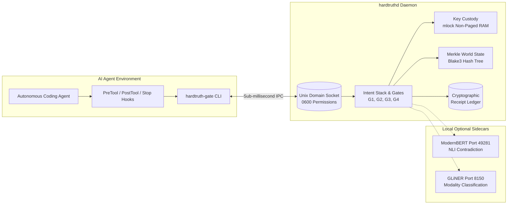
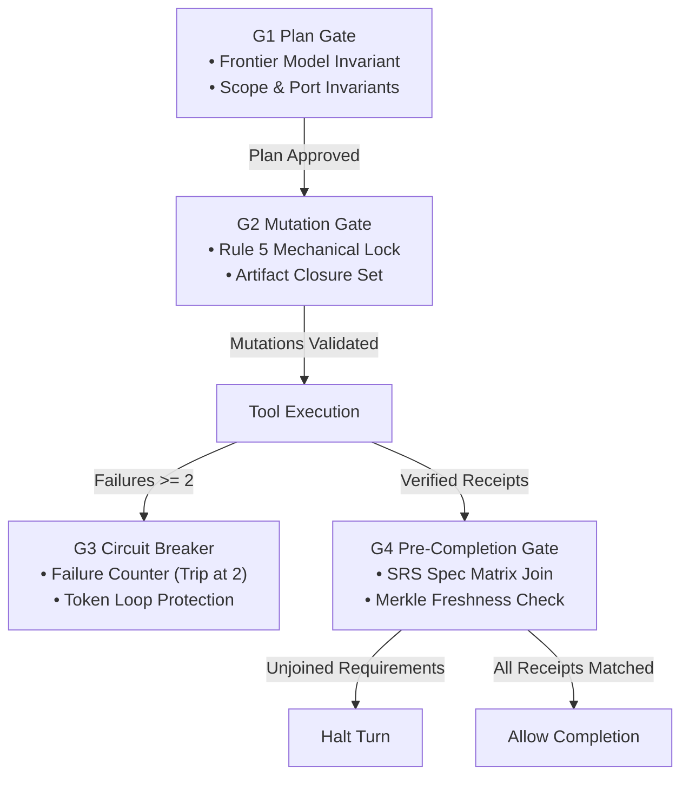

# HardTruth (`hardtruthd` & `hardtruth-gate`)

> **Autonomous Agent Lifecycle Interceptor & Verification Daemon (v0.2.0)**  
> High-performance resident integrity daemon and thin-client gate CLI written in native Rust.

[]()
[]()
[]()
[](LICENSE.md)

---

## 1. Project Intent & Design Philosophy

HardTruth is a systems-level integrity mechanism designed to address the divergence between conversational assertions generated by large language models and actual physical system state.

### The Phenomenon
Autoregressive language models predict successive tokens based on probabilistic distribution over training corpora. In multi-turn autonomous coding environments, language models demonstrate statistical drift toward conversational closure. When a model completes a turn, linguistic patterns strongly favor affirmative statements such as:
> *"All tests have passed and all services are configured."*

Such statements are generated based on conversational expectations rather than OS-level execution receipts. Prompt-based instructions (e.g., *"Be honest"*, *"Never assert tests passed without running them"*) operate within the same probabilistic generation space and frequently fail to prevent unverified completion claims.

### Design Intent
HardTruth separates conversational generation from physical execution verification. The project intent is to:
- **Intercept lifecycle boundaries**: Place deterministic hooks at agent pre-tool, post-tool, and turn completion boundaries.
- **Enforce architectural contracts (G1)**: Prevent non-frontier models from acting as lead system architects or planners.
- **Restrict unverified mutation (G2)**: Prevent arbitrary script synthesis across managed application trees without a valid compilation ticket or explicit git-tracked context.
- **Halt repetitive failure loops (G3)**: Detect repeated consecutive command failures and trip a circuit breaker before tokens and compute are exhausted.
- **Demand empirical receipts (G4)**: Verify that stated claims correspond to actual execution receipts (exit code 0 under matching Merkle repository state) before allowing completion.

---

## 2. Architecture & IPC

HardTruth comprises two primary binaries: a resident background daemon (`hardtruthd`) and an ephemeral thin-client CLI (`hardtruth-gate`).



### Resident Daemon (`hardtruthd`)
- **Language**: Native Rust using the Tokio asynchronous runtime.
- **Resource Envelope**: Sub-15MB resident set size (RSS), sub-millisecond execution times.
- **Telemetry Boundaries**: Operates entirely local to the host; emits no outbound network requests or cloud telemetry.

### Unix Domain Socket (UDS) IPC
Communication between `hardtruth-gate` and `hardtruthd` occurs exclusively over local Unix Domain Sockets:
- **macOS Path**: `~/Library/Caches/skidnir/hardtruth.sock`
- **Linux Path**: `/run/hardtruth/hardtruth.sock` (or `/tmp/hardtruth.sock`)
- **Permissions**: Created with strict `0600` permissions, restricted to the owning user process.
- **Latency**: Sub-millisecond round-trip IPC overhead per tool invocation.

### Non-Paged Memory Key Custody (`mlock`)
- Internal signing keys (256-bit HMAC) are allocated in RAM locked against paging to disk or swap space via `libc::mlock`.
- Employs `seckey` and `zeroize` memory protections; key bytes are cleared to zero on process termination (`SIGTERM`, `SIGINT`).

### Merkle World-State Tracking
- Uses Blake3 cryptographic hashing to track directory structures and file contents as a Merkle tree.
- When an execution receipt is recorded (e.g., `cargo test` exiting 0), the receipt stores the current `world_digest`.
- During verification, if files have changed since the test run, `world_digest(receipt) != world_digest(now)`. The receipt is marked stale, preventing stale passes from justifying subsequent completion claims.

### Anti-Hallucination Annotation Ladder
When unverified claims are detected in context or files, HardTruth provides in-place annotation:
- `⟨HT-VERIFIED: seq #N blake3:xxxx⟩`: Empirically witnessed by test execution matching current world state.
- `⟨HT-STALE: verified at seq #N, but files modified since⟩`: Previously verified, but invalidated by subsequent code mutations.
- `⟨HT-UNVERIFIED: no test receipt since seq #N⟩`: Asserted without a corresponding execution receipt.

---

## 3. Hardware Quarantine Invariant (Port 8000 Forbidden)

HardTruth enforces a negative constraint prohibiting any agent from binding to, probing, or communicating with hardware-reserved ports, specifically **Port 8000**.

### Enforcement Mechanism
1. **Shell AST Inspection**: Every command passed to the agent runner is parsed into an abstract syntax tree using `brush-parser`.
2. **Deterministic Rejection**: If an AST node contains references to port 8000 (e.g., `:8000`, `--port 8000`, `PORT=8000`, or network probing tools targeting port 8000), the command is rejected immediately with an invariant violation.
3. **Exit Masking Detection**: Commands containing shell exit-code masking operators (`; true`, `|| exit 0`, `|| true`) are detected and rejected to ensure tool failures propagate deterministically to the ledger.

---

## 4. The 4 Phase Gates

HardTruth structures agent lifecycle enforcement across four asymmetric gates:



### G1 Plan Gate (Planning & Architectural Invariant)
- **Objective**: Evaluates planning intent before execution begins.
- **Frontier Model Invariant**: Enforces that system design, PRD/SAD compilation, and architecture must be produced by verified frontier reasoning models (e.g., Claude Opus, Kimi k1.5, MiniMax Mimo Pro, DeepSeek Reasoner).
- **Prohibited Models**: Rejects Flash-tier models (all variants of `gemini-*-flash`) and `gemini-3.1-pro` from acting as lead architect or planner.
- **Port Checks**: Scans planned configurations for prohibited ports (specifically Port 8000).

### G2 Mutation Gate (Rule 5 Mechanical Lock & Artifact Closure)
- **Objective**: Restricts unverified script synthesis and file sprawl in managed codebases.
- **Rule 5 Invariant**: Prohibits the creation of un-gated scripts (`.py`, `.js`, `.ts`, `.sh`, `.rs`, etc.) within `apps/`, `services/`, or `scripts/` directories unless authorized by:
  1. An active VibeHard build context (`VIBEHARD_BUILD_ACTIVE=1`), or
  2. A cryptographic session ticket (`.gate/session_ticket`), or
  3. Pre-existing git-tracked status in the enclosing repository.
- **Exemptions**: Explicitly exempts ephemeral scratch directories (`scratch/`, `/tmp/`) and test suites (`tests/`).
- **Dynamic Closure Expansion**: Automatically extracts file paths from compiler error diagnostics (`--> src/foo.rs:12:5`) and stack traces to permit required fixes without breaking closure.

### G3 Circuit Breaker Gate (Loop Prevention)
- **Objective**: Halts repetitive failure cascades and prevents unbounded token burn.
- **Mechanism**: Tracks consecutive tool execution failures.
- **Trip Condition**: Trips automatically after 2 consecutive identical failures (`max_consecutive_failures = 2`).
- **State**: When tripped, subsequent mutations and execution attempts are denied until an operator or recovery workflow explicitly resets the breaker (`hardtruth-gate reset`).

### G4 Pre-Completion Gate (Receipt Ledger Verification)
- **Objective**: Enforces empirical verification before turn termination or task sign-off.
- **Mechanism**: Executes a relational join between stated Software Requirements Specification (SRS) items and the cryptographic receipt ledger.
- **Freshness Requirement**: Receipts are checked against the Merkle tree digest. If files were modified after the last test run, the receipt is considered stale and does not satisfy G4 requirements.

---

## 5. Build & Installation Instructions

### Prerequisites
- Rust 1.75 or later (via rustup):
  ```bash
  curl --proto '=https' --tlsv1.2 -sSf https://sh.rustup.rs | sh
  ```

### Compilation
To compile optimized release binaries for both `hardtruthd` and `hardtruth-gate`:

```bash
cargo build --release
```

The resulting binaries will be placed in `target/release/`:
- `target/release/hardtruthd` (Resident daemon)
- `target/release/hardtruth-gate` (Thin-client CLI gate)

### Verification
Run the integrated test suite:

```bash
cargo test
```

### Installation
Copy binaries to a directory present in your system `PATH`:

```bash
# User-level installation (recommended)
mkdir -p ~/.local/bin
cp target/release/hardtruthd ~/.local/bin/
cp target/release/hardtruth-gate ~/.local/bin/

# Or system-wide installation (requires sudo)
sudo cp target/release/hardtruthd /usr/local/bin/
sudo cp target/release/hardtruth-gate /usr/local/bin/
```

### Service Supervision

#### macOS (`launchd`)
Create `~/Library/LaunchAgents/com.skidnir.hardtruthd.plist`:

```xml
<?xml version="1.0" encoding="UTF-8"?>
<!DOCTYPE plist PUBLIC "-//Apple//DTD PLIST 1.0//EN" "http://www.apple.com/DTDs/PropertyList-1.0.dtd">
<plist version="1.0">
<dict>
    <key>Label</key>
    <string>com.skidnir.hardtruthd</string>
    <key>ProgramArguments</key>
    <array>
        <string>/Users/USER/.local/bin/hardtruthd</string>
    </array>
    <key>RunAtLoad</key>
    <true/>
    <key>KeepAlive</key>
    <true/>
    <key>StandardOutPath</key>
    <string>/Users/USER/Library/Logs/hardtruthd.log</string>
    <key>StandardErrorPath</key>
    <string>/Users/USER/Library/Logs/hardtruthd.err</string>
</dict>
</plist>
```

Load and start the daemon:
```bash
launchctl load ~/Library/LaunchAgents/com.skidnir.hardtruthd.plist
launchctl start com.skidnir.hardtruthd
```

#### Linux (`systemd`)
Create `/etc/systemd/system/hardtruthd.service` (or `~/.config/systemd/user/hardtruthd.service`):

```ini
[Unit]
Description=HardTruth Resident Integrity Daemon
After=network.target

[Service]
Type=simple
ExecStart=/usr/local/bin/hardtruthd
Restart=always
RestartSec=3
LimitMEMLOCK=infinity

[Install]
WantedBy=multi-user.target
```

Enable and start the service:
```bash
sudo systemctl daemon-reload
sudo systemctl enable --now hardtruthd
```

---

## 6. CLI Usage

The `hardtruth-gate` utility provides subcommands to query daemon status, evaluate gates, record receipts, and inspect commands.

### Daemon Communication & Status

```bash
# Probe daemon responsiveness over UDS
hardtruth-gate ping
# Output: pong

# Query daemon uptime, receipt counts, and circuit breaker health
hardtruth-gate status
```

### Phase Gate Evaluation

```bash
# Evaluate G1 (Plan Gate) with proposed architecture payload
hardtruth-gate gate G1 --payload '{"planner_model": "claude-3-5-sonnet", "planned_files": ["src/lib.rs"]}'

# Evaluate G2 (Mutation Gate) against target file paths
hardtruth-gate gate G2 --payload '{"mutated_files": ["src/lib.rs"]}'

# Check G3 (Circuit Breaker) status
hardtruth-gate gate G3

# Reset G3 Circuit Breaker after operator inspection
hardtruth-gate reset

# Evaluate G4 (Pre-Completion Gate) against required specifications
hardtruth-gate gate G4 --payload '{"requirements": [{"req_id": "REQ-01", "title": "Unit Tests", "verified_by_claim": "all tests pass"}]}'
```

### Shell AST Evaluation

Inspect shell commands for exit masking operators and hardware quarantine invariants:

```bash
# Permitted: exit code propagates cleanly
hardtruth-gate eval "cargo test --release"

# Rejected: contains masking operators (; true)
hardtruth-gate eval "cargo test ; true"

# Rejected: attempts to bind or probe forbidden Port 8000
hardtruth-gate eval "python3 -m http.server 8000"
```

### Receipt Recording & Verification

```bash
# Record an empirical execution receipt in the ledger
hardtruth-gate receipt "all tests pass" "cargo test" 0

# Cryptographically verify a claim against the current repository state
hardtruth-gate verify "all tests pass"

# Apply anti-hallucination annotation ladder to an output or file
hardtruth-gate annotate path/to/summary.md
```

### Agent Hook Integration
`hardtruth-gate` exposes integration entry points conforming to agent lifecycle hook protocols:
- `hardtruth-gate pre_tool`: Invoked before tool execution to enforce G2 mutations and AST safety.
- `hardtruth-gate post_tool`: Invoked after tool execution to record exit codes and monitor G3 failure loops.
- `hardtruth-gate stop`: Invoked before agent turn termination to verify G4 empirical closure.

---

## 7. License

HardTruth is licensed under the [PolyForm Noncommercial License 1.0.0](LICENSE.md).  
Free for individual, academic, and non-commercial development use. Commercial licenses required for enterprise production deployments.
