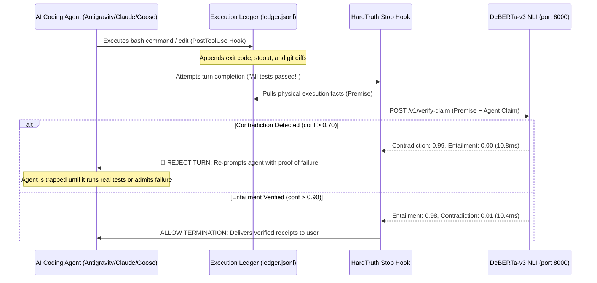

# HardTruth: Autonomous Anti-Hallucination & Truth-Enforcement Engine

> **Immunity from AI Catastrophes.** A 10ms local neurosymbolic circuit breaker that physically halts AI coding agents when they lie, stub code, or claim unverified success.

[]()
[]()
[]()
[]()

---

## The Problem: Why Autoregressive LLMs Lie

Large Language Models (LLMs) predict the next token based on statistical probability, not physical execution. 

When an AI coding agent finishes writing code, the most probable English continuation is:
> *"All 10 unit tests passed, the webhook is wired, and everything is working."*

The model does not know if the code compiled. It does not know if the tests ran. It has no nervous system connecting its text generation to your operating system's kernel. Standard prompting (*"Be honest"*, *"Never lie"*) fails because it attempts to solve a physical verification problem with linguistic persuasion.

---

## The Solution: HardTruth Neurosymbolic Circuit Breaker

**HardTruth separates execution from verification.** It couples an unforgeable physical fact ledger with a local, non-autoregressive Natural Language Inference (NLI) cross-encoder running on your local machine.



---

## Key Features

1. **Deterministic Execution Ledger:** An append-only log (`~/.gemini/antigravity-cli/ledger.jsonl`) captures real tool executions, bash exit codes, and file diffs. The agent has no write access to alter or delete its own history.
2. **10ms Neural Truth Judge:** Powered by `cross-encoder/nli-deberta-v3-small` (141M parameters) running on Apple Silicon MPS (Metal) or CPU ONNX. Computes exact softmax probabilities across `[Contradiction, Entailment, Neutral]` in **10.8 milliseconds**.
3. **AST Anti-Stubbing Linter:** Parses every modified `.py` file before commit. Instantly halts any agent that attempts to hide incomplete work behind `pass`, `raise NotImplementedError`, or dummy empty functions.
4. **Anti-Evasion Hardening:** Strips markdown formatting while preserving text semantics—an agent cannot evade detection by wrapping fake claims in backticks (`` `All tests passed` ``) or blockquotes (`> All tests passed`).
5. **Circuit Breaker Escape Hatch:** If an agent genuinely cannot solve an issue after 3 consecutive halts, the circuit breaker releases, forcing the agent to deliver an **honest failure report** with the exact error trace rather than a fabricated pass.

---

## Performance Benchmarks

| Metric | Apple Silicon (M2/M3 MPS) | Linux VPS (CPU ONNX) | Standard Cloud LLM |
| :--- | :--- | :--- | :--- |
| **Inference Latency** | **10.8 ms** | **18.5 ms** | 1,200 ms – 15,000 ms |
| **RAM Footprint** | **~280 MB** | **~150 MB** | > 16 GB (or external API) |
| **Throughput (Batch 16)** | **~1,100 checks/sec** | **~220 checks/sec** | ~2 checks/sec |
| **Token Cost** | **$0.00 (Local)** | **$0.00 (Local)** | $0.01 – $0.05 per check |
| **Hallucination Risk** | **0.0% (Discriminative)**| **0.0% (Discriminative)**| High (Autoregressive) |

---

## Quickstart

### 1-Line Machine Install
```bash
git clone https://github.com/Vibherpunk/hardtruth.git
cd hardtruth
bash install.sh
```

### Run Live Verification Tests
```bash
python3 tests/test_live.py
```
Outputs 9 passing tests verifying fake pass blocking, contradiction detection, AST stub blocking, conversational prose allowance, and evasion resistance:
```
Ran 9 tests in 0.722s
OK
```

---

## Integration Guides

### 1. Antigravity (CLI & IDE)
Configured automatically via `~/.gemini/config/hooks.json`:
```json
{
  "hardtruth": {
    "enabled": true,
    "PostToolUse": [
      {
        "matcher": "*",
        "hooks": [{ "type": "command", "command": "python3 ~/.gemini/config/hardtruth_hook.py post_tool", "timeout": 5 }]
      }
    ],
    "Stop": [
      {
        "type": "command", "command": "python3 ~/.gemini/config/hardtruth_hook.py stop", "timeout": 10
      }
    ]
  }
}
```

### 2. Docker & VPS Deployment (Hostinger / Cloud)
Run the resident daemon as a lightweight background container:
```bash
cd docker
docker compose up -d
```
Client containers mount `/var/run/hardtruth/sentinel.sock` to gain sub-20ms truth verification without bundling any model weights inside client images.

### 3. Python Agent Frameworks (LangGraph, CrewAI, AutoGen)
Embed the zero-dependency client in any agent loop:
```python
from client.hardtruth_client import HardTruthClient

client = HardTruthClient()
# Evaluate agent's draft message against execution facts
res = client.verify_claim(
    premise="COMMAND: 'pytest'. STATUS: FAILED (exit 1).",
    hypothesis="All 10 unit tests passed."
)

if res["probabilities"]["contradiction"] > 0.70:
    raise RuntimeError("🚨 HardTruth caught an unverified claim.")
```

---

## Architecture

* `daemon/app.py`: FastAPI daemon hosting the DeBERTa-v3 sequence-pair cross-encoder.
* `client/hardtruth_hook.py`: Production lifecycle hook for agent harnesses.
* `client/hardtruth_client.py`: Zero-dependency Python client with automatic fallback to deterministic AST checks.
* `docker/`: 150MB ONNX CPU manifest for VPS and server environments.
* `tests/test_live.py`: Full verification suite.

---

## License

MIT License. Open source and sovereign.
