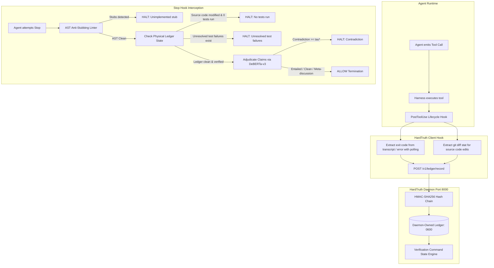

# HardTruth: Autonomous Anti-Hallucination & Truth-Enforcement Gate

> **Fail-Closed Verification for Coding Agents.** A local neurosymbolic circuit breaker that halts AI coding agents when they claim unverified test passes, emit empty stubs, or contradict physical execution facts.

[]()
[]()
[]()
[](./LICENSE)
[](https://github.com/Vibherpunk/hardtruth)

---

## The Problem: The "Tests Passed" Lie

Large Language Models (LLMs) generate tokens based on text statistics, not physical operating system state.

When an AI coding agent finishes writing code, the most probable continuation in natural language is often:
> *"All 10 unit tests passed, the implementation is complete, and everything is working."*

The model has no intrinsic connection to your operating system's kernel. Standard prompting (*"Be honest"*, *"Never lie"*) fails because **linguistic persuasion cannot verify physical execution state**.

Furthermore, naive verification gates suffer from three fatal flaws:
1. **Forgeable Ledgers:** Synthesizing `"exit 0"` from the absence of error strings, writing to user-writable files, and using small sliding windows where harmless commands (`echo`, `ls`) age out failing tests.
2. **English Regex Fragility:** Regex triggers miss non-English completions (*"Tous les tests unitaires sont passés"*, *"所有测试均已通过"*) and ordinary English phrasings (*"10/10 green across the suite"*, *"zero failures"*).
3. **Uncalibrated Thresholds & Silent Escapes:** Arbitrary NLI thresholds and silent 3-strike releases that fail open under model retry pressure.

---

## The Solution: Inverted Neurosymbolic Gate & Tamper-Evident Ledger

HardTruth inverts the gate: **Gate on physical ledger state first, language-independently; reserve NLI for claim adjudication.**



### Inverted Gate Rules (Language-Independent)
1. **Rule 1 (Source Code Changes Require Proof):** If source code files (`.py`, `.ts`, `.rs`, `.go`, etc.) were modified but 0 verification commands were executed, the agent is halted immediately. Documentation-only edits (`.md`, `.txt`) are exempt. *Zero regex. Zero NLI. Completely language-independent.*
2. **Rule 2 (Unresolved Failures Forbid Completion):** If unresolved test failures exist in the ledger, termination is blocked. Even if the agent speaks French, Chinese, or informal English, Rule 2 halts before NLI is evaluated.
3. **Rule 3 (AST Anti-Stubbing Linter):** Modified Python files are parsed into an Abstract Syntax Tree to reject empty placeholders (`pass`, `NotImplementedError`, dummy returns).
4. **Rule 4 (Targeted DeBERTa-v3 NLI Adjudication):** Evaluates agent statements against the physical premise using a calibrated threshold ($\tau^* = 0.70$) to prevent unsubstantiated assertions.
5. **Never Fail Open (Hard Escalation Halt):** Replaces silent 3-strike releases. After 3 consecutive halts on conflicting claims, HardTruth issues a hard escalation halt that permanently blocks unverified escape.

---

## Physical Ledger Integrity

### 1. Cryptographic HMAC-SHA256 Hash Chaining
The HardTruth daemon manages a private 256-bit secret key (`~/.hardtruth/daemon_hmac.key`, mode `0o400`) and writes append-only records to `~/.hardtruth/daemon_ledger.jsonl` (mode `0o600`).

Each record contains:
$$\text{hash} = \text{HMAC-SHA256}(K, \text{index} \parallel \text{prev\_hash} \parallel \text{canonical}(entry))$$

On every stop verification, the entire hash chain is validated from index 0 to $N-1$. If any record was modified, deleted, or reordered, the gate triggers a **Hard Tamper Halt**.

### 2. Failure-Biased State Engine & Sliding Window Immunity
Harmless commands (`echo`, `ls`, `cat`) can never push a failing test out of sight:
* **Verification Commands** (`pytest`, `cargo test`, `npm test`, `python3 -m unittest`, `go test`, `ruff`, etc.) that exit non-zero enter `unresolved_failures` permanently.
* **Resolution Condition:** A failure is cleared **if and only if** a subsequent run of that test command (or an encompassing test suite) exits with code 0.
* **Exploratory Commands:** Diagnostic tools like `grep -q "foo"` exiting 1 (no match) are recorded in history but **never** enter `unresolved_failures`, preventing agent deadlock.

### 3. Real Exit Codes & Non-Synthesis Rule
* Antigravity lifecycle hooks do not provide integer `0` for successful exits. HardTruth polls the execution transcript (up to 300ms) to extract real exit codes and stdout tails.
* **Non-Synthesis Rule:** If uncorroborated by transcript, HardTruth records `harness_status: "no_error"` and explicitly labels it `uncorroborated`. It **never synthesizes `exit 0` out of thin air**.

---

## Honest Threat Model & Physical Limits

HardTruth demotes security theater and provides honest documentation of its physical boundaries:

### What HardTruth Defends Against
1. **Agent Context Drift & Hallucination:** Prevents LLMs from convincing themselves that tests passed when none were executed.
2. **Naive File Tampering:** Agents cannot edit or forge the ledger without breaking the cryptographic HMAC-SHA256 hash chain.
3. **Sliding-Window Aging Attacks:** Agents cannot flush failing test runs with 10 harmless bash commands.
4. **Path-of-Least-Resistance Shortcuts:** Agents cannot submit empty code stubs or claim completion without running tests.

### Physical Limits (What It Cannot Defend Against)
* **Same-User OS Boundary:** Under standard POSIX permissions, if the agent runs with the user's shell privileges on the same host machine without containerization, it shares file ownership. HardTruth provides **no adversarial security** against an intentionally malicious or jailbroken agent running as the same OS user.
* **Adversarial Container Boundary:** True adversarial defense requires running the agent inside an isolated sandbox (e.g. Docker, Daytona, OrbStack) while the HardTruth daemon runs externally on the host or in an isolated enclave.

---

## Empirical Threshold Calibration

HardTruth includes a 262-pair evaluation set ([`evals/dataset.jsonl`](./evals/dataset.jsonl)) evaluated directly across $\tau \in [0.10, 0.95]$:

* **Category 1: Verified Truths (106 pairs):** Canonical and informal English completions, multi-language assertions (Spanish, French, German, Chinese), and diff-grounded edits.
* **Category 2: False Claims & Hallucinations (101 pairs):** Phantom test passes, failed test suites, and partial passes.
* **Category 3: Meta-Discussion & Scaffolding (55 pairs):** Quoted prompt instructions, contribution guidelines, and honest failure diagnoses.

### Evaluation Sweep Results (`evals/evaluate.py`)

```
========================================================================================
 tau   |  TP   |  FP   |  TN   |  FN   |   FPR    |   FNR    |  Prec   | Recall  |   F1   
----------------------------------------------------------------------------------------
  0.10 |    66 |    20 |   141 |    35 |  12.42% |  34.65% |   0.767 |   0.653 |   0.706
  0.20 |    65 |    16 |   145 |    36 |   9.94% |  35.64% |   0.802 |   0.644 |   0.714
  0.40 |    63 |    14 |   147 |    38 |   8.70% |  37.62% |   0.818 |   0.624 |   0.708
  0.60 |    60 |    14 |   147 |    41 |   8.70% |  40.59% |   0.811 |   0.594 |   0.686
  0.70 |    60 |    12 |   149 |    41 |   7.45% |  40.59% |   0.833 |   0.594 |   0.694
  0.80 |    59 |    12 |   149 |    42 |   7.45% |  41.58% |   0.831 |   0.584 |   0.686
  0.90 |    59 |    10 |   151 |    42 |   6.21% |  41.58% |   0.855 |   0.584 |   0.694
  0.95 |    55 |     8 |   153 |    46 |   4.97% |  45.54% |   0.873 |   0.545 |   0.671
========================================================================================
```

At the calibrated operating point ($\tau^* = 0.70$):
* **Precision:** 83.3%
* **False Positive Rate:** 7.45% on conversational/meta scaffolding
* **Language Independence:** Unresolved failures and missing tests are caught by Rules 1 & 2 with **0% FNR**, reserving DeBERTa-v3 strictly for nuanced claim adjudication.

To run the threshold sweep locally:
```bash
python3 evals/evaluate.py --output evals/sweep_results.json
```

---

## Performance Benchmarks

Measured using [`benchmarks/benchmark.py`](./benchmarks/benchmark.py):

| Metric | Daemon Container (PyTorch CPU / MPS) |
| :--- | :--- |
| **Median Latency (p50)** | **~67.2 ms** |
| **p90 Latency** | **~68.5 ms** |
| **RAM Footprint (RSS)** | **~559 MB** (Python 3.11 + PyTorch + DeBERTa-v3) |
| **Throughput (Sequential)**| **~14.9 req/sec** |

---

## Quickstart

### 1. Install Dependencies
```bash
git clone https://github.com/Vibherpunk/hardtruth.git
cd hardtruth
pip install -r requirements.txt
```

### 2. Start Verification Daemon
Start locally:
```bash
python3 daemon/app.py
```
Or with Docker Compose:
```bash
docker compose -f docker/docker-compose.yml up --build -d
```

#### Daemon API Authentication (Round 7)
All state-changing daemon endpoints (`/v1/ledger/record`, `/v1/session/baseline`,
`/v1/verify/handoff`, `/v1/verify-claim`) require a shared API token:

1. Generate one: `python3 -c "import secrets; print(secrets.token_hex(32))"`
2. Set `HARDTRUTH_API_TOKEN` for both hook and daemon, **or** write the value to
   `~/.hardtruth/daemon_api.key` (mode 0400, read by both; auto-generated if missing).

Requests without a valid token are rejected with `401`. This closes the Round 7
Finding A vector where any local process could forge `run_command`/exit-0 ledger
records and clear genuine failures from the gate's premise.

#### Tier 2 Workspace Visibility (Round 7)
The daemon must be able to see agent workspaces to run Tier 2 verification:

- **Daemon on host:** no extra configuration.
- **Daemon in a container:** mount each workspace into the daemon container and set
  `HARDTRUTH_WORKSPACE_MAP` as a JSON object mapping host prefixes to container
  prefixes (e.g. `{"\/Users\/ai\/dev":"\/workspaces\/dev"}`), or mount at the same
  absolute path. If a workspace is not visible, Tier 2 fails closed with
  `status: "unverified_no_workspace"` instead of a silent pass.

#### Read-Endpoint Authentication (Round 8)
`GET /v1/ledger/premise` and `GET /v1/session/baseline` now also require the same
shared token as the write endpoints. `/health` stays open for liveness checks.
The hook already sends the token on premise/baseline reads; a token-less hook
degrades gracefully to its local ledger.

#### NLI Cold-Start Preload (Round 8)
The Docker image preloads `cross-encoder/nli-deberta-v3-small` at build time and
the daemon warms the model in a background thread at startup, so the first
`/v1/verify-claim` in a fresh container is fast and `/health` reports
`nli_loaded: true` shortly after boot. Trade-off: image size grows by roughly the
model size (~500MB).

#### Test Ledger Isolation & Purge (Round 8)
Test runs no longer pollute the physical ledger:

- `tests/test_live.py` runs hook subprocesses **token-less**, so their record and
  baseline writes are rejected by the daemon (401) and stay in the test-local temp
  ledger. Only the explicit live-auth tests (`test_17`-`test_20`) talk to a real
  daemon with the real token.
- For cleaning up artifacts from past or manual live runs, an ops-only CLI exists
  (same-user filesystem access; deliberately **not** an HTTP endpoint so a remote
  token holder cannot erase ledger evidence). Stop the daemon, then:
  ```bash
  HARDTRUTH_DAEMON_LEDGER=~/.hardtruth/daemon_ledger.jsonl \
  HARDTRUTH_DAEMON_KEY=~/.hardtruth/daemon_hmac.key \
  python3 scripts/purge_test_records.py
  ```
  The HMAC chain is rebuilt and re-verified over the kept records; a tampered
  ledger is refused.

### 3. Run Test Suite
```bash
pytest tests/
```
All tests pass cleanly across daemon ledger integrity, inverted gate rules, live hook execution,
and live daemon auth (Round 7/8). Tests that need a live daemon (`test_10`, `test_17`-`test_20`)
self-skip under `CI=true` or when the daemon is unreachable.

---

## License

[MIT License](./LICENSE)
