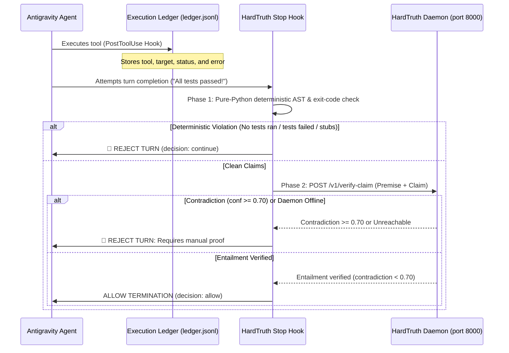

# HardTruth: Autonomous Anti-Hallucination & Truth-Enforcement Gate

> **Fail-Closed Verification for Coding Agents.** A local neurosymbolic circuit breaker that halts AI coding agents when they claim unverified test passes, emit empty stubs, or contradict physical execution facts.

[]()
[]()
[](./LICENSE)
[](https://github.com/Vibherpunk/hardtruth)

---

## The Problem: The "Tests Passed" Lie

Large Language Models (LLMs) generate tokens based on text statistics, not physical operating system state.

When an AI coding agent finishes writing code, the most probable continuation in natural language is often:
> *"All 10 unit tests passed, the implementation is complete, and everything is working."*

The model has no intrinsic connection to your operating system's kernel. Standard prompting (*"Be honest"*, *"Never lie"*) fails because **linguistic persuasion cannot verify physical execution state**.

Once an agent hallucinates a fake success statement into its context window, that claim becomes accepted context for subsequent turns, leading the agent into an compounding cycle of false assumptions.

---

## The Solution: Two-Phase Neurosymbolic Gate

HardTruth separates execution from claim verification using two distinct layers:

1. **Deterministic Execution Layer:** Captures real tool calls and exit statuses into a local append-only JSONL ledger (`ledger.jsonl`), and checks modified Python files for empty stubs using an Abstract Syntax Tree (AST) analyzer.
2. **System One NLI Layer:** Runs a local `cross-encoder/nli-deberta-v3-small` model (via PyTorch MPS or CPU) to evaluate whether the agent's natural-language completion assertions are entailed by or contradict the physical execution facts.
3. **Fail-Closed Behavior:** If the daemon is unreachable, the gate **fails closed**—refusing unverified factual claims with `decision: "continue"` so that unproven assertions degrade to manual verification rather than passing silently.



---

## Capabilities & Enforced Invariants

### 1. Stopping the "Fake Test Pass" Lie
If an agent claims tests passed (e.g. *"All 10 unit tests passed"*), HardTruth inspects the execution ledger.
* If **no commands** ran in the session, the turn is immediately halted (`decision: "continue"`).
* If commands ran but **failed** (non-zero exit code or error output), the turn is immediately halted with a contradiction warning.
* If matching test commands executed with exit code 0, the claim is verified.

### 2. AST Anti-Stubbing Linter
HardTruth's AST analyzer (`client/ast_checker.py`) checks every modified Python file. Any function reduced to a vacuous body is rejected before completion:
* `pass`
* `raise NotImplementedError` / `raise NotImplementedError()` / `raise NotImplementedError("...")`
* `...` (Ellipsis)
* `return True` or `return None` / bare `return` as the sole body statement

**False Positive Suppression:** Legitimate abstract declarations are explicitly exempted:
* Classes inheriting from `typing.Protocol`
* Methods decorated with `@abstractmethod`
* Functions decorated with `@overload`

### 3. Machine-Wide Git Pre-Commit Gate
`install.sh --global` configures a global git pre-commit hook (`~/.hardtruth/hooks/pre-commit`). Any commit across the entire machine containing empty stubs in staged `.py` files is rejected at the git level, protecting repositories from stubbed code regardless of which agent or tool wrote it.

### 4. Circuit Breaker Escape Hatch
To prevent infinite loops when an agent cannot resolve an issue, HardTruth maintains a counter in `~/.hardtruth/halts/` (isolated with mode `0o700` and hashed conversation IDs). After 3 consecutive halts on the same conversation, the circuit breaker releases with a visible warning in the returned `reason`.

---

## Execution Ledger Schema

The deterministic ledger is stored at `~/.gemini/antigravity-cli/ledger.jsonl` (or configured via `HARDTRUTH_LEDGER_PATH`). Each entry is a single JSON record:

```json
{
  "timestamp": 1726792345.12,
  "conversationId": "test-conv-uuid",
  "stepIdx": 8,
  "tool": "run_command",
  "target": "python3 -m unittest test_daemon.py",
  "status": "success",
  "error": null
}
```

* `tool`: The tool invoked (`run_command`, `write_to_file`, `replace_file_content`, `view_file`).
* `target`: The command string or absolute file path.
* `status`: `"success"` or `"error"`.
* `error`: Error message or non-zero exit code string if the command failed.

---

## Performance Benchmarks

Measured using the committed benchmark reproduction script [`benchmarks/benchmark.py`](./benchmarks/benchmark.py):

| Metric | Docker Container (Linux CPU on Apple Silicon) |
| :--- | :--- |
| **Median Latency (p50)** | **~73.2 ms** |
| **p90 Latency** | **~82.3 ms** |
| **p99 Latency** | **~86.5 ms** |
| **RAM Footprint (RSS)** | **~528 MB** (Python 3.11 + PyTorch CPU + DeBERTa-v3) |
| **Throughput (Sequential)**| **~13.7 req/sec** |

*Hardware: Apple Silicon Mac (ARM64), OrbStack Linux Docker Engine, PyTorch CPU wheel.*

To reproduce benchmarks locally:
```bash
python3 benchmarks/benchmark.py http://127.0.0.1:8000 20
```

---

## Quickstart

### Prerequisites
* Python 3.10+
* Docker & Docker Compose (optional, for daemon container)

### 1. Clone Repository & Install Dependencies
```bash
git clone https://github.com/Vibherpunk/hardtruth.git
cd hardtruth
pip install -r requirements.txt
```

### 2. Start Verification Daemon
You can run the daemon directly:
```bash
python3 daemon/app.py
```
Or start via Docker Compose:
```bash
docker compose -f docker/docker-compose.yml up --build -d
```
Verify the daemon is healthy:
```bash
curl -s http://127.0.0.1:8000/health
```

### 3. Install Hooks
```bash
# Installs Antigravity lifecycle hook and library:
bash install.sh

# Optional: To enable machine-wide git commit gate across all repositories:
bash install.sh --global
```

### 4. Run Test Suite
```bash
# Run against live daemon:
python3 tests/test_live.py

# Run with daemon unreachable (verifies fail-closed behavior):
SYSTEM_ONE_URL=http://127.0.0.1:9 python3 tests/test_live.py
```

All 16 tests pass with the daemon online and with it unreachable.

---

## Integration

### 1. Antigravity (CLI & IDE)
Configured automatically by `install.sh` in `~/.gemini/config/hooks.json`:
```json
{
  "hardtruth": {
    "enabled": true,
    "PostToolUse": [
      {
        "matcher": "*",
        "hooks": [{ "type": "command", "command": "python3 ~/.gemini/config/hardtruth_hook.py post_tool", "timeout": 5 }]
      }
    ],
    "Stop": [
      {
        "type": "command", "command": "python3 ~/.gemini/config/hardtruth_hook.py stop", "timeout": 10
      }
    ]
  }
}
```

### 2. Python Agent Loops (Custom Scripts)
Embed the client directly into custom Python agents:
```python
from client.hardtruth_client import HardTruthClient, CONTRADICTION_THRESHOLD

client = HardTruthClient("http://127.0.0.1:8000")

# Check if daemon is responsive
if client.is_daemon_online():
    res = client.verify_claim(
        premise="COMMAND: 'pytest tests/'. STATUS: FAILED (exit status 1).",
        hypothesis="All 10 unit tests passed completely."
    )
    if res and res["probabilities"]["contradiction"] >= CONTRADICTION_THRESHOLD:
        print("🚨 Blocked: Agent claim contradicts execution ledger!")
```

---

## Repository Structure

* `daemon/app.py`: Dedicated FastAPI verification daemon hosting `cross-encoder/nli-deberta-v3-small` with thread-safe lazy loading and `/health` monitoring.
* `client/ast_checker.py`: Shared AST stub detection module (detects `pass`, `NotImplementedError`, `...`, `return True/None`; exempts `@abstractmethod`, `@overload`, and `Protocol`).
* `client/hardtruth_hook.py`: Antigravity lifecycle hook (`PostToolUse` and `Stop`) with fail-closed gate logic.
* `client/hardtruth_client.py`: Python client library with `/health` polling and deterministic AST fallback.
* `docker/`: Dockerfile and docker-compose.yml for Linux/VPS deployment using official PyTorch CPU wheels.
* `tests/test_live.py`: 16-case test suite verifying fail-closed execution, stub detection, filter safety, and contradiction detection.
* `benchmarks/benchmark.py`: Committed benchmark reproduction script measuring latency and memory.

---

## License

[MIT License](./LICENSE)
