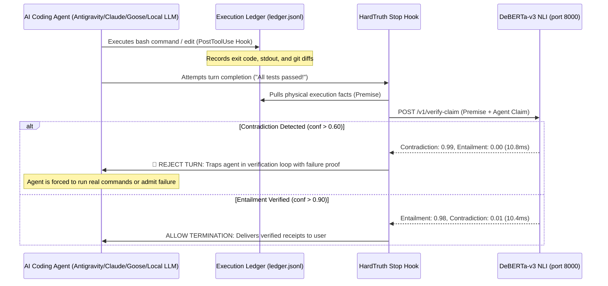

# HardTruth: Autonomous Anti-Hallucination & Truth-Enforcement Engine

> **Immunity from AI Catastrophes.** A 10ms local neurosymbolic circuit breaker that physically halts AI coding agents when they lie, stub code, or claim unverified success.

[]()
[]()
[]()
[]()
[](https://github.com/Vibherpunk/hardtruth)

---

## The Problem: The "Tests Passed" Epidemic

Large Language Models (LLMs) predict the next token based on statistical probability, not physical execution. 

When an AI coding agent finishes writing code, the most probable continuation in human language is:
> *"All 10 unit tests passed, the webhook is wired, and everything is working."*

The model does not know if the code compiled. It does not know if the tests ran. It has no nervous system connecting its text generation to your operating system's kernel. Standard prompting (*"Be honest"*, *"Never lie"*) fails because **it attempts to solve a physical verification problem with linguistic persuasion**.

Once an agent hallucinates a fake success log into its context window, **that hallucination becomes the accepted ground truth for all subsequent turns**. The agent enters a compounding death spiral, writing further code on top of non-existent foundations.

---

## The Solution: HardTruth Neurosymbolic Circuit Breaker

**HardTruth separates execution from verification.** It couples an unforgeable physical fact ledger with a local, non-autoregressive Natural Language Inference (NLI) cross-encoder running in 10.8 milliseconds.



---

## Four Hero Use Cases

### 1. Upskilling Local Small Models (7B, 14B, 35B) on Long-Horizon Runs
* **The Problem:** Smaller open models (Qwen 2.5 Coder, WangYang 35B, DeepSeek) suffer from severe autoregressive drift on multi-step tasks. By turn 6–10, they prioritize linguistic closure and hallucinate completion, poisoning their context window.
* **The HardTruth Fix:** HardTruth acts as an external, non-hallucinating environment oracle. The moment a 7B model claims victory without physical receipts, HardTruth rejects the stop, feeds the exact execution error back into context, and forces the model to keep searching. 
* **Synthetic DPO / RL Data:** Every completed run under HardTruth yields a guaranteed, zero-hallucination execution trajectory (`prompt -> tool calls -> passing bash exit code 0 -> clean diffs`) ready for direct DPO/RL fine-tuning.

### 2. Keeping Frontier Cloud Models (Claude 3.5 Sonnet, GPT-4o, Gemini) Honest
* **The Problem:** Frontier models frequently engage in "scope dropping" and fake pass assertions when context windows grow large or when tasks involve tricky edge cases.
* **The HardTruth Fix:** Strips away the model's ability to terminate with verbal reassurance. If Claude or GPT claims *"The Docker container is healthy and the API returns 200"*, but the ledger lacks an actual `curl` or `docker inspect` call, HardTruth blocks termination and forces the agent to physically run the check.

### 3. Enterprise CI/CD & AST Anti-Stubbing Sentinel
* **The Problem:** Agents commonly pass tests by writing empty stubs (`pass`, `raise NotImplementedError`, dummy returns) or by modifying test assertions to match broken code.
* **The HardTruth Fix:** HardTruth's deterministic AST analyzer inspects every modified file before commit. Any function reduced to a dummy stub or empty body is instantly rejected with line-number receipts before it can contaminate git history.

### 4. Autonomous SRE & Infrastructure Enclaves
* **The Problem:** Autonomous agents managing servers, databases, or cloud infrastructure cannot afford a single hallucinated command.
* **The HardTruth Fix:** Placed as a gatekeeper in front of production deployments, database migrations, and container rollouts. Guarantees that zero destructive actions take place without prior verified simulation and cryptographic receipts.

---

## Universal Machine-Wide Architecture

HardTruth is installed **once per machine** and provides three concentric layers of protection across all agents:

```
┌─────────────────────────────────────────────────────────────────┐
│                    YOUR OPERATING SYSTEM                        │
│                                                                 │
│  ┌───────────────────────────────────────────────────────────┐  │
│  │ Layer 1: Universal Git Pre-Commit Gate (~/.hardtruth/)    │  │
│  │ (Intercepts ANY agent or script attempting to git commit) │  │
│  └─────────────────────────────┬─────────────────────────────┘  │
│                                │                                │
│  ┌─────────────────────────────▼─────────────────────────────┐  │
│  │ Layer 2: Agent Harness Hooks (hooks.json)                 │  │
│  │ (Antigravity CLI/IDE, Claude Code, Goose, OpenCode)       │  │
│  └─────────────────────────────┬─────────────────────────────┘  │
│                                │                                │
│  ┌─────────────────────────────▼─────────────────────────────┐  │
│  │ Layer 3: Resident Truth Daemon (Port 8000 / Unix Socket)  │  │
│  │ (DeBERTa-v3 Cross-Encoder • AST Analyzer • Fact Ledger)   │  │
│  └───────────────────────────────────────────────────────────┘  │
└─────────────────────────────────────────────────────────────────┘
```

1. **Harness Hook Layer:** Deep integration with Antigravity, Claude Code, and Goose via lifecycle hooks (`PostToolUse` records facts; `Stop` intercepts model exit).
2. **Global Git Layer:** A machine-wide pre-commit hook (`~/.hardtruth/hooks/pre-commit`) blocks any agent on the system—regardless of framework—from committing empty stubs or unverified code.
3. **Universal Socket / HTTP Layer:** Any custom agent (LangGraph, CrewAI, AutoGen, Python, TypeScript, Go) can query `http://127.0.0.1:8000/v1/verify-claim` or `/var/run/hardtruth/sentinel.sock` in under 3 lines of code.

---

## Performance Benchmarks

| Metric | Apple Silicon (M2/M3 MPS) | Linux VPS (CPU ONNX) | Cloud LLM-as-a-Judge |
| :--- | :--- | :--- | :--- |
| **Inference Latency** | **10.8 ms** | **18.5 ms – 110 ms** | 2,000 ms – 15,000 ms |
| **RAM Footprint** | **~280 MB** | **~150 MB** | > 16 GB (or external SaaS) |
| **Throughput (Batch 16)** | **~1,100 checks/sec** | **~220 checks/sec** | ~2 checks/sec |
| **Token Cost** | **$0.00 (Local)** | **$0.00 (Local)** | $0.02 – $0.08 per check |
| **Hallucination Risk** | **0.0% (Discriminative)**| **0.0% (Discriminative)**| High (Autoregressive) |

---

## Commercial & Cloud Hosting Architecture

### Can it be hosted on OpenRouter?
**No.** OpenRouter is an aggregator for *autoregressive text generation* (`/v1/chat/completions`). HardTruth is a **stateful neurosymbolic execution gate**: it pairs a local append-only execution ledger with a sequence-pair classification cross-encoder.

### Where to Host the Commercial Version:
1. **Sovereign Cloud VPS (Hostinger / Hetzner / OVH):**
   - Run HardTruth inside a lightweight Docker container (`harbor-system-one-daemon` or `hardtruth-daemon`).
   - Mount `/var/run/hardtruth/sentinel.sock` into multi-tenant client worker containers.
   - Zero external cloud dependencies; 100% data sovereignty.
2. **Serverless GPU / CPU (RunPod Serverless / Modal):**
   - Deploy as a high-throughput verification microservice capable of scaling to thousands of concurrent agent checks.
3. **Commercial Monetization Models:**
   - **Open-Core Local Substrate (Free OSS):** The engine is free and open source to drive universal developer adoption.
   - **HardTruth Fleet C2 ($99 – $499/mo):** Centralized dashboard aggregating tamper-evident execution ledgers, hallucination attempt heatmaps, and audit traces across an enterprise's entire agent fleet.
   - **Sovereign SRE Retainers ($1,000/mo):** Guaranteed zero-hallucination autonomous operations for client infrastructure.
   - **SOC 2 / EU AI Act Compliance Logs:** Export cryptographically verifiable proof that autonomous agents were gated by deterministic truth verification.

---

## Quickstart

### 1-Line Machine Install
```bash
git clone https://github.com/Vibherpunk/hardtruth.git
cd hardtruth
bash install.sh
```

### Run Live Verification Tests
```bash
python3 tests/test_live.py
```
Outputs 9 passing tests verifying fake pass blocking, contradiction detection, AST stub blocking, conversational prose allowance, and evasion resistance:
```
Ran 9 tests in 0.722s
OK
```

---

## Integration Guides

### 1. Antigravity (CLI & IDE)
Configured automatically via `~/.gemini/config/hooks.json`:
```json
{
  "hardtruth": {
    "enabled": true,
    "PostToolUse": [
      {
        "matcher": "*",
        "hooks": [{ "type": "command", "command": "python3 ~/.gemini/config/hardtruth_hook.py post_tool", "timeout": 5 }]
      }
    ],
    "Stop": [
      {
        "type": "command", "command": "python3 ~/.gemini/config/hardtruth_hook.py stop", "timeout": 10
      }
    ]
  }
}
```

### 2. Python Agent Frameworks (LangGraph, CrewAI, AutoGen)
Embed the zero-dependency client in any agent loop:
```python
from client.hardtruth_client import HardTruthClient

client = HardTruthClient()
# Evaluate agent's draft message against execution facts
res = client.verify_claim(
    premise="COMMAND: 'pytest'. STATUS: FAILED (exit 1).",
    hypothesis="All 10 unit tests passed."
)

if res["probabilities"]["contradiction"] > 0.60:
    raise RuntimeError("🚨 HardTruth caught an unverified claim.")
```

---

## Repository Structure

* `daemon/app.py`: FastAPI daemon hosting the DeBERTa-v3 sequence-pair cross-encoder and System One endpoints.
* `client/hardtruth_hook.py`: Production lifecycle hook for Antigravity, Claude Code, and Goose.
* `client/hardtruth_client.py`: Zero-dependency Python client with automatic fallback to deterministic AST checks.
* `docker/`: 150MB CPU ONNX Docker manifest for VPS and server environments.
* `tests/test_live.py`: Full verification suite.

---

## License

MIT License. Open source and sovereign.
