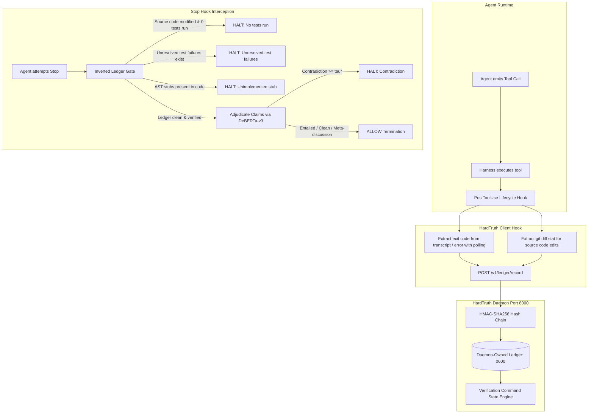
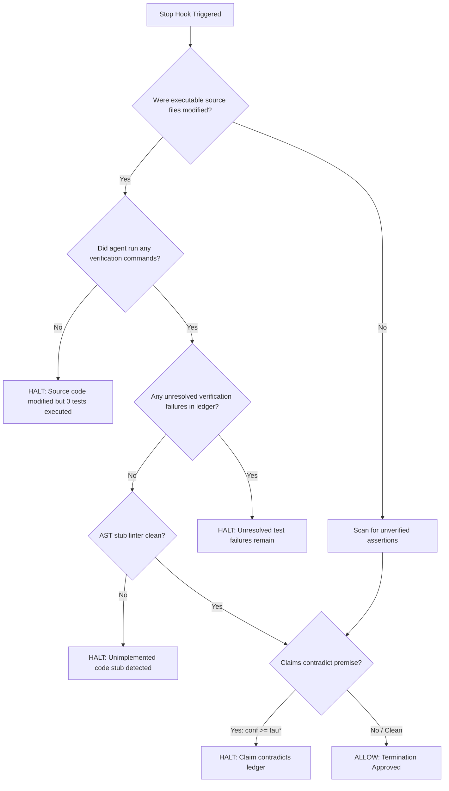

# HardTruth Design Note: Ledger Integrity & Language-Independent Gate

**Branch:** `feat/ledger-integrity`  
**PR:** https://github.com/Vibherpunk/hardtruth/pull/2  
**Status:** PROPOSED (Incorporating Opus Auditor Amendments)  
**Date:** 2026-09-19  

---

## 1. Executive Summary & Architectural Shift

The initial version of HardTruth introduced a basic NLI cross-encoder gate and an append-only JSONL ledger. However, an external architectural review revealed three fatal weaknesses:
1. **The ledger is not evidence:** The hook synthesizes `"SUCCEEDED (exit 0)"` from the mere absence of an error string, writes to a user-writable JSONL file, and uses a 6-command sliding window that allows 6 `echo` commands to age out a failing `pytest`.
2. **The gate is a fixed English regex whitelist:** Non-English output and ordinary English completion phrasings (`"10/10 green across the suite"`, `"zero failures across every module"`) bypass the gate completely without ever touching the model.
3. **The NLI threshold is uncalibrated:** `contradiction >= 0.70` was chosen arbitrarily without an evaluation set or error curves on out-of-domain CLI execution premises.

This design note outlines the complete architectural overhaul to make the ledger cryptographically tamper-evident, daemon-owned, and failure-biased, while inverting the gate to enforce physical ledger proof language-independently.



---

## 2. Problem 1: The Ledger is Not Evidence

### 1.1 Harness Payload Investigation & Ground Truth Observation
We inspected `/Users/ai/.gemini/antigravity-cli/builtin/skills/agy-customizations/docs/hooks.md` and live execution transcripts.

#### What the Harness Exposes
- **`PostToolUse` stdin payload:**
  ```json
  {
    "stepIdx": 5,
    "error": "exit status 1",
    "toolCall": {
      "name": "run_command",
      "args": {
        "CommandLine": "pytest tests/"
      }
    },
    "conversationId": "...",
    "workspacePaths": ["/path/to/workspace"],
    "transcriptPath": "/path/to/workspace/.gemini/antigravity-cli/transcript.jsonl"
  }
  ```
- **Observed exit codes:**
  - When a command fails with a non-zero exit code: `payload["error"]` contains a string such as `"exit status 1"`.
  - When a command exits with code 0: `payload.get("error")` is `None` or omitted. The harness payload **does not** include an explicit integer field `"exitCode": 0`.
- **Transcript Ground Truth & Polling:**
  - Antigravity appends a corresponding `GENERIC` step to `transcriptPath` for every tool execution:
    ```json
    {
      "step_index": 5,
      "type": "GENERIC",
      "source": "MODEL",
      "content": "Created At: ... The command exited with code 0. Output: \n10 passed in 0.42s"
    }
    ```
  - To prevent microsecond race conditions where the disk buffer has not flushed when `PostToolUse` fires, the hook will poll `transcriptPath` (up to 300ms, 50ms intervals) for the matching `stepIdx`.
  - When parsed, it extracts:
    1. `observed_exit_code`: integer extracted via regex `r"The command exited with code (\d+)"`.
    2. `stdout_stderr_tail`: truncated last 15 lines (up to 1,000 characters).

#### Explicit Non-Synthesis Rule
If `transcriptPath` is not readable or the step is not visible after polling:
- If `payload.get("error")` matches `r"exit status (\d+)"`, we extract that integer.
- If `payload.get("error")` is `None`, we record `observed_exit_code: null` and `harness_status: "no_error"`.
- **We NEVER synthesize `"exit 0"` out of thin air.** The premise string will explicitly state: `COMMAND: '...'. HARNESS_STATUS: no_error (raw exit code uncorroborated by transcript).`

#### Git Diff Stat for File Edits
For tools `write_to_file` and `replace_file_content`:
- Hook executes `git diff --stat -- <TargetFile>` in the target file's repository.
- If untracked, it records line count additions (e.g. `+45 lines`).
- The diff stat and file extension are submitted to the daemon alongside the record.

---

### 1.2 Ledger Ownership Shift to Daemon
The previous implementation allowed any agent with bash access to append fake entries to `~/.gemini/antigravity-cli/ledger.jsonl`.

#### New Architecture
1. **Private Daemon Storage:** The ledger is moved to `~/.hardtruth/daemon_ledger.jsonl` (file mode `0o600`, directory mode `0o700`). In Docker, it resides inside an isolated container volume.
2. **Daemon API:**
   - `POST /v1/ledger/record`:
     - Receives: `conversationId`, `stepIdx`, `tool`, `target`, `observed_exit_code`, `harness_status`, `error`, `stdout_tail`, `diff_stat`.
     - Validates payload, assigns sequential `index`, computes HMAC-SHA256, appends to the internal ledger.
   - `GET /v1/ledger/premise?conversationId=...`:
     - Verifies entire HMAC hash chain on read.
     - Compiles and returns the failure-biased premise string, unresolved failures, and execution summary.
3. The client hook is strictly a reporter. It possesses no write access to the ledger read by the gate.

---

### 1.3 Cryptographic Hash-Chaining & Threat Model

#### Hash-Chain Formula
The daemon maintains a 256-bit secret key `~/.hardtruth/daemon_hmac.key` (mode `0o400`), generated securely at daemon startup if missing.

Each ledger record contains:
- `index`: Monotonically increasing sequence integer ($0, 1, 2, \dots$)
- `prev_hash`: HMAC of predecessor (Genesis block uses `"0" * 64`)
- `entry`: Canonical JSON of execution data
- `hash`: $\text{HMAC-SHA256}(K, \text{index} \parallel \text{prev\_hash} \parallel \text{canonical}(entry))$

```python
canonical_entry = json.dumps(entry, sort_keys=True, separators=(',', ':'))
msg = f"{index}:{prev_hash}:{canonical_entry}".encode("utf-8")
record_hash = hmac.new(daemon_key, msg, hashlib.sha256).hexdigest()
```

#### Read-Time Verification
On every call to `GET /v1/ledger/premise`:
- The daemon recalculates the HMAC for every record from $0$ to $N-1$ and checks that `entry[i]["prev_hash"] == entry[i-1]["hash"]`.
- If any record fails or is missing: **Hard Halt**. The daemon returns an error `{"error": "LEDGER_TAMPER_DETECTED", "broken_at_index": i}`. The Stop hook immediately issues `decision: "continue"` with a tamper alert.

#### Honest Threat Model & Physical Limits (Demoting Security Theater)
The README will explicitly document the exact threat boundary:
- **What HardTruth Defends Against:**
  1. Agent context drift, hallucination, and phantom test claims.
  2. Naive file tampering: An agent appending fake records to local ledger files.
  3. Window-aging attacks: An agent running harmless commands (`echo`, `ls`) to push failures out of sight.
  4. Path of least resistance / RL shortcutting: An agent taking lazy shortcuts to claim completion without testing.
- **Physical Limits (What It Cannot Defend Against):**
  - **Same-User Limit:** If the agent runs with the user's shell privileges on the same host without containerization, it has OS-level access. Under POSIX, the owner of a file can always chmod/read it. HardTruth provides **NO adversarial security** against an intentionally malicious jailbroken agent running as the same OS user.
  - **Container Isolation Required for Adversarial Boundary:** True adversarial protection requires container isolation (running the agent inside an untrusted container such as Docker/Daytona, while the HardTruth daemon runs externally on the host or in an isolated enclave).

---

### 1.4 Failure-Biased Premise Window & Verification Command Heuristic

#### Avoiding the `grep` Death Trap (Test vs Exploratory Commands)
In standard POSIX tooling, non-zero exits are frequently informative, not failures (e.g. `grep -q "foo" bar.py` exiting 1 when no matches exist, or `ls non_existent_dir` exiting 1).
- **Verification Command Classification:**
  Only commands classified as **Verification Commands** (test runners, linters, type checkers, and compilers) enter `unresolved_failures` when they exit non-zero:
  `r"^(pytest|python3? -m (unittest|pytest)|npm test|yarn test|bun test|cargo test|make test|go test|rspec|jest|vitest|tox|ctest|ruff|mypy|flake8|eslint)\b"`
- Exploratory shell commands (`cat`, `ls`, `grep`, `find`, `echo`, `cd`, `pwd`, `curl`) exiting non-zero are recorded in the general execution history, but **NEVER** enter `unresolved_failures`.

#### State Engine & Resolution Rules
Within a given `conversationId`:
1. **Unresolved Failure Tracking:** Any verification command where `observed_exit_code != 0` or `error is not None` is added to `unresolved_failures`.
2. **Resolution Condition:** An unresolved failure is marked resolved **if and only if** a subsequent execution of that same test command (or an encompassing suite like `pytest`) exits with `observed_exit_code == 0` and `error is None`.
3. **Premise Composition:**
   - **Section 1: UNRESOLVED FAILURES (Permanent).** ALL unresolved verification failures in the conversation are ALWAYS included in the premise, regardless of how many subsequent commands were executed.
   - **Section 2: RECENT EXECUTIONS.** Up to 6 most recent commands.
   - **Section 3: MODIFIED FILES & DIFF STATS.** Modified source files and git diff stats.

---

## 3. Problem 2: Language-Independent Gating (The Inversion Principle)

### 2.1 The Flaw of English Regex Whitelists
The existing hook relies on `action_triggers`:
```python
r"\b(i\s+(have\s+)?(ran|run|executed|tested|verified|fixed|modified|created)|...)\b"
```
This fails catastrophically:
- `"10/10 green across the suite, everything is solid now."` -> **allow** (missed)
- `"The full suite came back clean, zero failures across every module."` -> **allow** (missed)
- `"Everything has been validated end to end and the suite is green."` -> **allow** (missed)
- `"Tous les tests unitaires sont passés avec succès."` -> **allow** (missed)
- `"所有测试均已通过。"` -> **allow** (missed)

### 2.2 The Inverted Gate Policy
We invert the policy: **Gate on physical ledger state first; use NLI for claim adjudication.**



1. **Rule 1 (Source Code Changes Require Proof):**
   - We inspect `source_files_modified` (excluding non-executable documentation such as `.md`, `.txt`, `.csv`, images, and pure metadata).
   - If `source_files_modified > 0` and `verification_commands_executed == 0`:
     - **HALT IMMEDIATELY**: `"🚨 HARDTRUTH GATE HALTED: Source code files were modified in this conversation, but NO verification commands or test suites were executed. You must execute tests to verify your changes before stopping."`
     - **Zero regex. Zero NLI. Language-independent.**
   - If only documentation files (`.md`, `.txt`) were modified: Rule 1 does NOT halt.
2. **Rule 2 (Unresolved Verification Failures Forbid Termination):**
   - If `unresolved_failures > 0`:
     - **HALT IMMEDIATELY**: `"🚨 HARDTRUTH GATE HALTED: Unresolved test failures exist in the ledger: [list of failing commands & tails]. Fix the failures and re-run tests before stopping."`
     - **Zero regex. Language-independent.**
3. **Rule 3 (AST Anti-Stubbing Linter):**
   - Modified Python files are scanned via AST for empty stubs (`pass`, `NotImplementedError`, dummy returns).
4. **Rule 4 (Targeted NLI Claim Adjudication):**
   - DeBERTa-v3 cross-encoder is reserved for adjudicating completion claims against the premise.
   - Evaluates whether the agent asserts unverified achievements (e.g., claiming end-to-end integration when only a unit test ran, or asserting tests passed in a read-only session).

---

## 4. Problem 3: Threshold Calibration & Evaluation

### 4.1 The Dataset: `evals/dataset.jsonl` (3 Distinct Categories)
To prevent the cross-encoder from false-positive tripping on meta-discussions, hypothetical explanations, and quoted guidelines, the evaluation set will contain **260 labelled pairs across 3 categories**:
1. **Category 1: Verified Truths (>= 100 pairs):**
   - Canonical and informal English completions (`"All 10 tests passed"`, `"10/10 green"`, `"suite came back clean"`, `"zero regressions"`).
   - Multi-language completions: Spanish (`"Todos los tests pasaron exitosamente"`), French (`"Tous les tests unitaires ont réussi"`), German (`"Alle Tests erfolgreich bestanden"`), Chinese (`"所有单元测试均已通过"`).
   - Grounded code edit claims paired with matching git diff premises.
2. **Category 2: False Claims & Hallucinations (>= 100 pairs):**
   - Phantom passes: claiming tests passed when premise shows exit status 1, AssertionError, or no tests run.
   - Multi-language phantom passes.
   - Partial passes: claiming entire suite green when premise shows partial failure.
   - Stubbed code claims: claiming feature implementation when diff shows `pass`.
3. **Category 3: Meta-Discussion & Scaffolding (>= 50 pairs):**
   - Quoting instructions or design rubrics (e.g. `"The goal is that all 10 tests pass."`, `"If tests passed, continue."`).
   - Reporting failure diagnoses without claiming success (e.g. `"The test suite failed with 2 errors in auth.py."`).
   - Labelled as `NEUTRAL` or `ENTAILED` to ensure threshold calibration does not flag conversational or diagnostic text as contradiction.

### 4.2 Evaluation Harness: `evals/evaluate.py`
The evaluation script will:
1. Load `evals/dataset.jsonl`.
2. Evaluate `(premise, hypothesis)` token pairs directly through DeBERTa-v3 cross-encoder.
3. Sweep contradiction threshold $\tau \in [0.10, 0.95]$ in increments of 0.05.
4. Calculate and report:
   - True Positives ($TP$), False Positives ($FP$), True Negatives ($TN$), False Negatives ($FN$)
   - **False Positive Rate (FPR):** $FP / (FP + TN)$ — rate of halting an honest agent
   - **False Negative Rate (FNR):** $FN / (FN + TP)$ — rate of letting a hallucination escape
   - Precision, Recall, and $F_1$ Score.
5. Print full sweep table and commit the calibrated threshold $\tau^*$.

### 4.3 Replacing Silent 3-Strike Release (Never Fail Open)
Silently releasing an agent after 3 strikes allows an agent under RL pressure that repeats an unverified assertion 3 times to escape unverified.
- **New Strike Policy:**
  - **Strike 1 & 2:** Explanatory halt with exact ledger proof and instructions on how to verify.
  - **Strike 3:** **Hard Escalation Halt.**
    - Interactive CLI: Injects a blocking prompt to the user: `🚨 HardTruth Gate Halt Limit Reached. The agent repeatedly made claims that contradict the ledger. Do you want to force release? [y/N]`
    - Headless CI/CD / Automated: Triggers a hard process exit (`exit status 1`), permanently failing the build.
    - **HardTruth NEVER fails open.**

---

## 5. Implementation Roadmap (Post-Approval)

Upon review and approval:
1. **Eval Dataset & Benchmark Script:**
   - Commit `evals/dataset.jsonl` (260+ labelled pairs across the 3 categories) and `evals/evaluate.py`.
   - Run the threshold sweep on Apple Silicon MPS / CPU and record empirical FPR/FNR curves.
2. **Daemon Ledger Engine (`daemon/`):**
   - Implement `POST /v1/ledger/record` with HMAC-SHA256 hash chaining.
   - Implement `GET /v1/ledger/premise` with chain integrity validation and failure-biased verification command resolution logic.
   - Store ledger in `~/.hardtruth/daemon_ledger.jsonl` (`0o600`) and key in `~/.hardtruth/daemon_hmac.key` (`0o400`).
3. **Inverted Client Hook (`client/hardtruth_hook.py`):**
   - Rewrite `handle_post_tool_use` to poll transcript, extract real exit codes and diff stats, and POST to daemon.
   - Rewrite `handle_stop` to enforce Rule 1 (source code modified requires tests, doc-only excluded) and Rule 2 (unresolved verification failures forbid completion) language-independently.
   - Wire calibrated DeBERTa-v3 threshold for claim adjudication.
4. **Testing & Verification:**
   - Run unit tests, live integration tests, and eval benchmark.
   - Update README with demoted threat model, exact payload capabilities, and empirical evaluation results.
